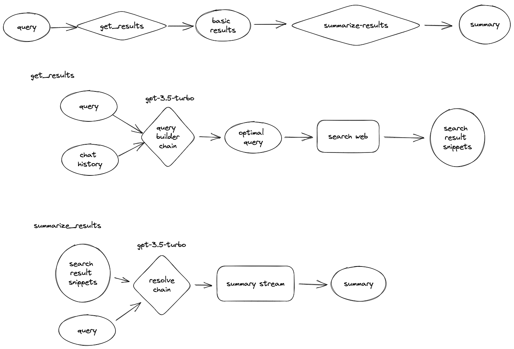

# AI Assisted Search Engine

 

A next-generation AI-assisted search engine that allows you to discuss topics, ask questions, troubleshoot code, and have the search engine provide useful context for AI chat.

 

Built with:
- Next.js 13 (Edge functions)
- Streaming
- TailwindCSS
- TypeScript
- LangChain
- Framer Motion
- OpenAI GPT

## Overview

 

## Features

### Current Functionality
- Search snippets
- Basic response
- Basic memory (short context length)

### Planned Improvements
- Agent tools (web browser, calculator, code sandbox)
- Toggle models (GPT-3 vs GPT-4)
- Better prompting

## Installation

1. Clone this repository to your local machine.
```
git clone https://github.com/jedwards1230/search.git
```

2. Navigate to the project directory and install dependencies.
```
cd search
npm install
```

3. Obtain API keys for OpenAI and Google and add them to the `.env.local` file.
```
OPENAI_API_KEY=your_openai_api_key
GOOGLE_CSE_ID=your google cse id
GOOGLE_API_KEY=your google api key
```

4. Build and run the project locally.
```
npm run build
npm run dev
```

Then, open your browser and navigate to http://localhost:3000 to start using the AI Assisted Search Engine.

## Contributing

We welcome contributions from the community! Feel free to open issues, fork the repository, and submit pull requests to help improve this AI-assisted search engine.

## License

This project is licensed under the MIT License. See the `LICENSE` file for details.