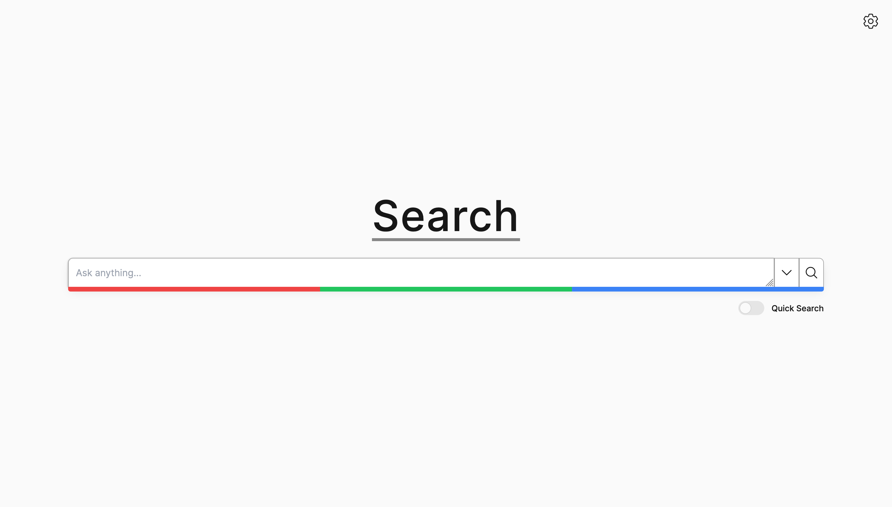
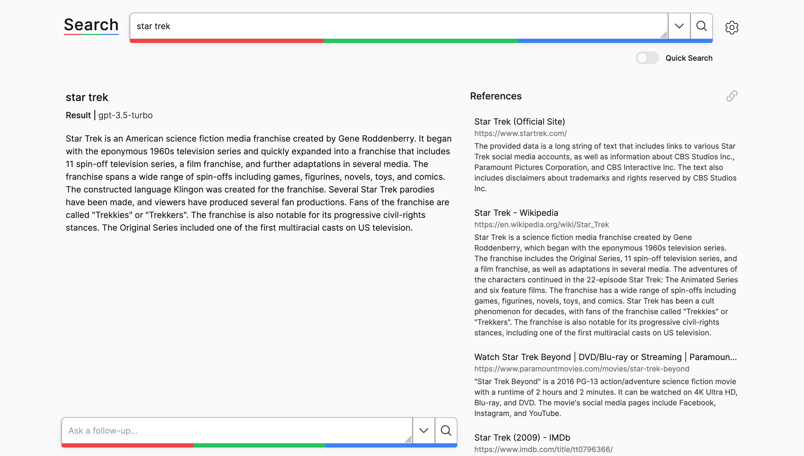

# AI Assisted Search Engine



A next-generation AI-assisted search engine designed for discussing topics, asking questions, troubleshooting code, and engaging with AI chat while receiving relevant contextual information.



Built using:

-   Next.js 13 (Edge functions)
-   Streaming
-   TailwindCSS
-   TypeScript
-   LangChain
-   Framer Motion
-   OpenAI GPT

## Features

-   Scrapes, vectorizes, and summarizes the top 5 Google search results
-   Quick search
    -   Enabled: Summarize results based on google snippets
    -   Disabled: Summarize results based on scraped pages
-   Stores basic chat history
-   Progressive web app (PWA)

### Planned Improvements

-   Integration with alternative search engines
-   Enhanced agent tools (web browser, calculator, code sandbox)
-   Improved chat history management
    -   Store chat history in a database
    -   Vectorize chat history
-   Caching
-   Optimized prompting

## Installation

1. Clone this repository to your local machine.

```
git clone https://github.com/jedwards1230/search.git
```

2. Navigate to the project directory and install dependencies.

```
cd search
npm install
```

3. Obtain API keys for OpenAI and Google and add them to the `.env.local` file.

```
OPENAI_API_KEY=your_openai_api_key
GOOGLE_CSE_ID=your google cse id
GOOGLE_API_KEY=your google api key
```

4. Build and run the project locally.

```
npm run build
npm run dev
```

Then, open your browser and navigate to http://localhost:3000 to start using the AI Assisted Search Engine.

## Contributing

We welcome contributions from the community! Feel free to open issues, fork the repository, and submit pull requests to help improve this AI-assisted search engine.

## License

This project is licensed under the MIT License. See the `LICENSE` file for details.
